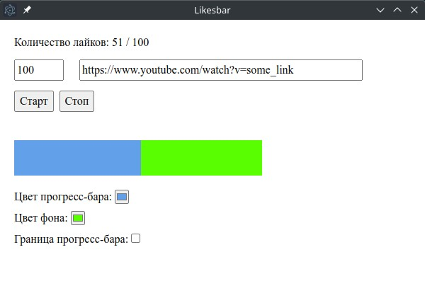

# Likesbar

Это приложение для стримеров, которые хотят добавить прогресс-бар лайков, для того, чтобы чуточку больше замотивировать подписчиков ставить лайки.

## Как пользоваться

- скачать exe файл из репозитория и запустить
- выставить количество лайков, которые требуется получить
- вставить ссылку на видео/стрим
- выбрать цвета
- нажать кнопку "Старт"

Зеленый цвет фона - для хромакея. Цвета можно делать кастомные. Также можно добавить рамку. Пока что цвет рамки черный и ширина 2px.

## Алгоритм приложения

Алгоритм довольно простой: выполняется запрос на страницу видео/стрима, в ответе приходит html, в котором с помощью regex получаем и обрабатываем количество лайков.

Во избежания блокировки ip адреса, с которого делаются запросы, я выставил случайное время следующего запроса от 10 до 15 секунд. Но я еще недостаточно тестировал этот момент.

**В пользовательском соглашении ютюба написано, что парсинг не через их API запрещен и может караться баном аккаунта, так что пользуйтесь на свой страх и риск.** Не уверен, как они будут проверять каким способом происходит парсинг.

## Roadmap

В планах добавить больше кастомизации, возможность сохранять шаблоны

Пожелания пишите мне в ТГ: https://t.me/alveek
